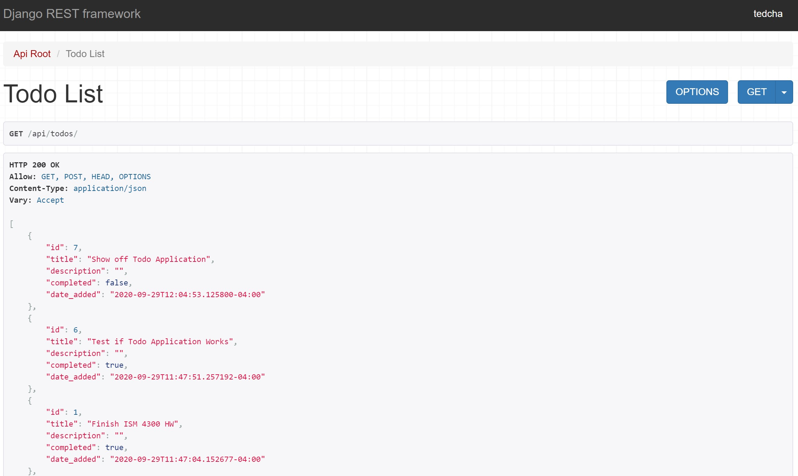
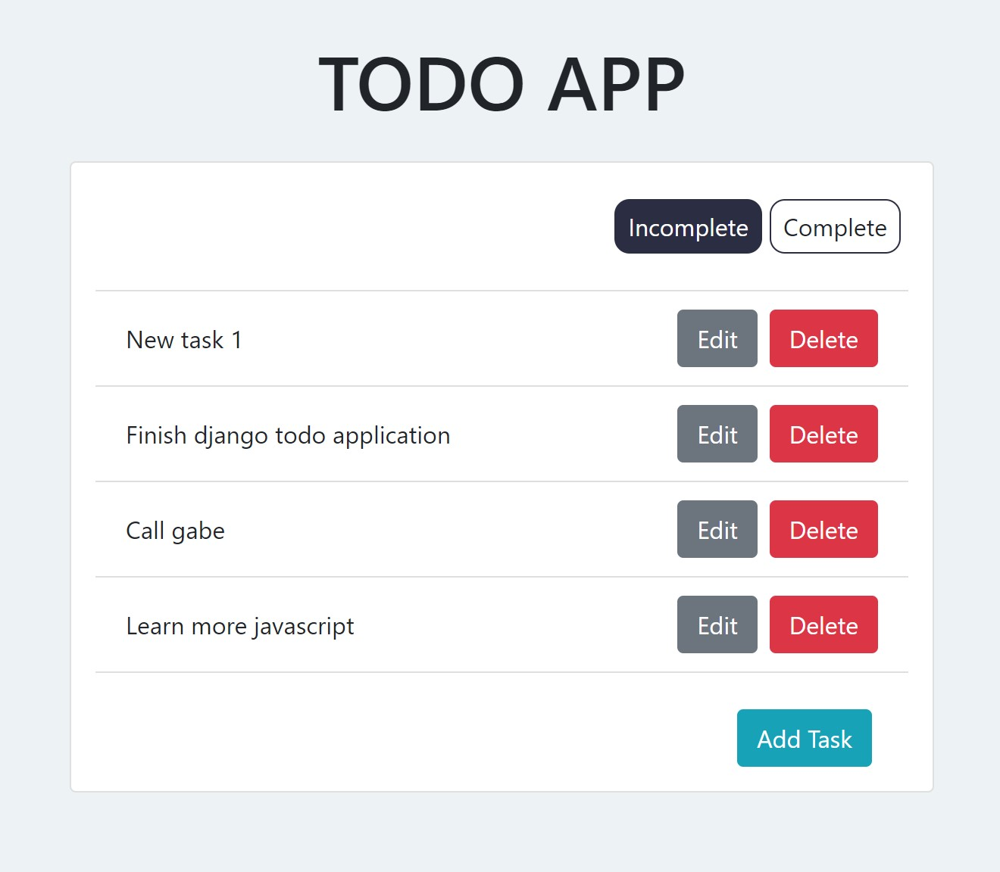
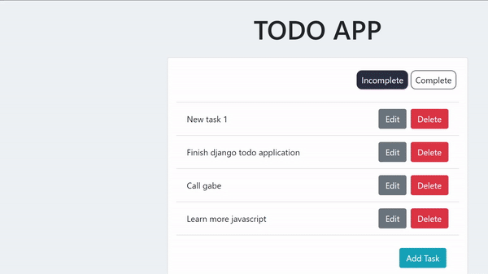

# Django-React Todo

Quick and simple project for gaining an introductory understanding of the Django REST Framework to create an API and serve it to a React frontend.

## References
This web application was built by using a [tutorial created by Jordan Irabor](https://www.digitalocean.com/community/tutorials/build-a-to-do-application-using-django-and-react).

## About
Since gaining a fundamental understanding of Django and being able to apply my understanding into a full fledge application (check out [QuikTap](https://github.com/tcharts-boop/quiktap)) I've decided to learn more about Front-End frameworks, specifically React.

## Demo

Here is what the application looks like:

REST API JSON Data (Django Backend):


Todo Application (React Frontend):


Demo of Functionality:



## Installation

To install and test the web application on your local machine, all you need to do is clone the GitHub repo with the following command:

```bash
git clone https://github.com/tcharts-boop/js-css-variables.git
```

From there, set up the development environment.

### Development Environment

You'll have to setup two developer environments for this tutorial: the Django environment and the React Environment.

#### Django Development Environment

After the repository is cloned you'll have to download the required dependencies.
For this project, I utilized Pipenv to track my dependencies.

While in the top level directory `django-react-todo` run the following command:
```bash
pipenv install
```

This will setup a pipenv environment and install all of the dependencies to the environment.

To activate the environment, use the following command:
```bash
pipenv shell
```
##### Migrations, Super User, and Run Server

While in the pipenv environment, run the following command to make migrations to create your database (sqlite3):
```bash
python manage.py makemigrations
```

To actually run the migrations, use the following command:
```bash
python manage.py migrate
```

From there, your database is setup but you'll want to make a super user to access the admin panel:
```bash
python manage.py createsuperuser
```

Lastly, run the development server:
```bash
python manage.py runserver
```

The website should now be available at `localhost` (*Note: Django defaults to http://127.0.0.1:8000/*).

#### React Dependencies

Download and install [Node.js](https://nodejs.org/en/download/).

Use the following command to install `create-react-app` globally:

```bash
npm install -g create-react-app
```

## Usage

To use, first go through the installation guide above. 

To run, first move into the frontend directory and start the api:

```bash
cd frontend && yarn start-api
```

After Django is running, start another terminal instance and run the following command in the frontend directory:

```bash
yarn start
```

The application should open up and you are free to test the application and/or start modifying the code to your own usage.
